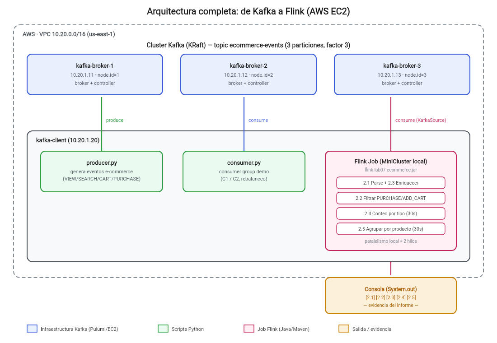

# Kafka + Flink Streaming Lab


Laboratorio del curso **Big Data** (UNSA) que implementa, desde cero y completamente documentado, un pipeline de procesamiento de eventos en tiempo real: un clúster distribuido de **Apache Kafka** en AWS EC2 (aprovisionado con **Pulumi**) y un job de **Apache Flink** que consume, filtra, transforma, cuenta y agrupa esos eventos.

Todo el proceso —incluyendo un bug real encontrado y corregido durante el despliegue— queda documentado paso a paso en [`informe/`](informe/), que funciona a la vez como reporte académico y como guía reproducible: cada resultado va acompañado del comando exacto que lo generó.

---

## Arquitectura



- **Cluster Kafka** (KRaft, sin Zookeeper): 3 brokers EC2 (`kafka-broker-1/2/3`), cada uno actuando como broker y controller a la vez, con el topic `ecommerce-events` (3 particiones, factor de replicación 3).
- **Cliente** (`kafka-client`): una sola instancia EC2 que corre el productor y el consumidor en Python, y el job de Flink (en modo local/embebido, sin un clúster de Flink aparte — ver el [informe](informe/) para el detalle de por qué).
- **Infraestructura como código**: toda la VPC, subred, security group e instancias EC2 se definen en [`infrastructure/`](infrastructure/) con Pulumi (Python); nada se configura a mano por SSH.

---

## Qué se demuestra

**Kafka** — los 6 conceptos pedidos por la guía del curso:

- [x] Producer
- [x] Consumer
- [x] Topic
- [x] Partition
- [x] Offset
- [x] Consumer Group

**Flink** (Laboratorio 07) — las 5 actividades de la guía:

- [x] 2.1 — Consumir eventos desde Kafka
- [x] 2.2 — Filtrar eventos de compra (`PURCHASE`, `ADD_CART`)
- [x] 2.3 — Transformar: agregar hora, día, mes y fin de semana
- [x] 2.4 — Conteo de eventos por tipo (ventanas de 30s)
- [x] 2.5 — Agrupamiento por producto (ventanas de 30s)

---

## Tecnologías

| Categoría | Herramienta |
|---|---|
| Streaming | Apache Kafka 3.9.0 (modo KRaft), Apache Flink 2.2.1 |
| Infraestructura | AWS EC2, Pulumi (Python) |
| Lenguajes | Python (productor/consumidor, scripts), Java 11 (job de Flink) |
| Build | Maven (`flink-job/`) |
| Informe | LaTeX — template de [Pablo Pizarro](https://template-latex.github.io/informe) |

---

## Estructura del proyecto

```text
kafka-flink-streaming-lab/
├── especificaciones/          # Enunciados del docente (PDF)
├── informe/                   # Informe LaTeX (reporte + guía reproducible)
│   └── img/                    # Evidencia: capturas, diagramas
├── infrastructure/            # Pulumi (Python): VPC, 3 brokers KRaft + cliente
├── keys/                      # kafka-lab-key.pem (NO se sube, ver .gitignore)
├── topics.yaml                # Definición declarativa de topics
├── producer/                  # producer.py — genera eventos e-commerce
├── consumer/                  # consumer.py — consumer group configurable
├── flink-job/                 # Proyecto Maven del Laboratorio 07
│   └── src/main/java/pe/edu/unsa/bigdata/lab07/
├── scripts/kafka/              # create_topics.py y utilidades CLI
├── md/                         # Plan y bitácora de ejecución
│   └── plan.md
├── docs/images/                # Diagramas usados en este README
├── .gitignore
└── README.md
```

---

## Cómo reproducirlo

La ejecución completa (con cada comando explicado) está en [`informe/`](informe/) y en [`md/plan.md`](md/plan.md). En resumen:

1. **Infraestructura**: `cd infrastructure && pulumi up` — crea la VPC, el Security Group y las 4 instancias EC2. Kafka se instala y configura solo, vía `user_data` (nada manual).
2. **Topic**: copiar `topics.yaml` y `scripts/kafka/create_topics.py` al cliente y correrlo — crea `ecommerce-events`.
3. **Kafka**: correr `producer.py` y `consumer.py` desde el cliente para demostrar los 6 conceptos.
4. **Flink**: compilar `flink-job/` con `mvn clean package`, copiar el jar al cliente, y correrlo con `java -jar` mientras el productor genera tráfico.

> Requiere una cuenta de AWS (este laboratorio se corrió sobre AWS Academy) y el archivo `kafka-lab-key.pem` del key pair correspondiente en `keys/`.

---

## Documentación

- [`informe/`](informe/) — informe completo en LaTeX (compilarlo con `main.tex`), documenta cada paso con su comando y evidencia.
- [`md/plan.md`](md/plan.md) — plan de trabajo y bitácora de ejecución (decisiones, incidentes, IPs de cada despliegue).
- [`especificaciones/especificaciones.pdf`](especificaciones/especificaciones.pdf) — guía original del Laboratorio 07 (Flink).

---

## Autor

**Jorge Alfredo Tito Ccahuaya** — Escuela Profesional de Ciencias de la Computación, Universidad Nacional de San Agustín de Arequipa.
Curso: Big Data (1705157) — Profesor: Alvaro Henry Mamani Aliaga.
